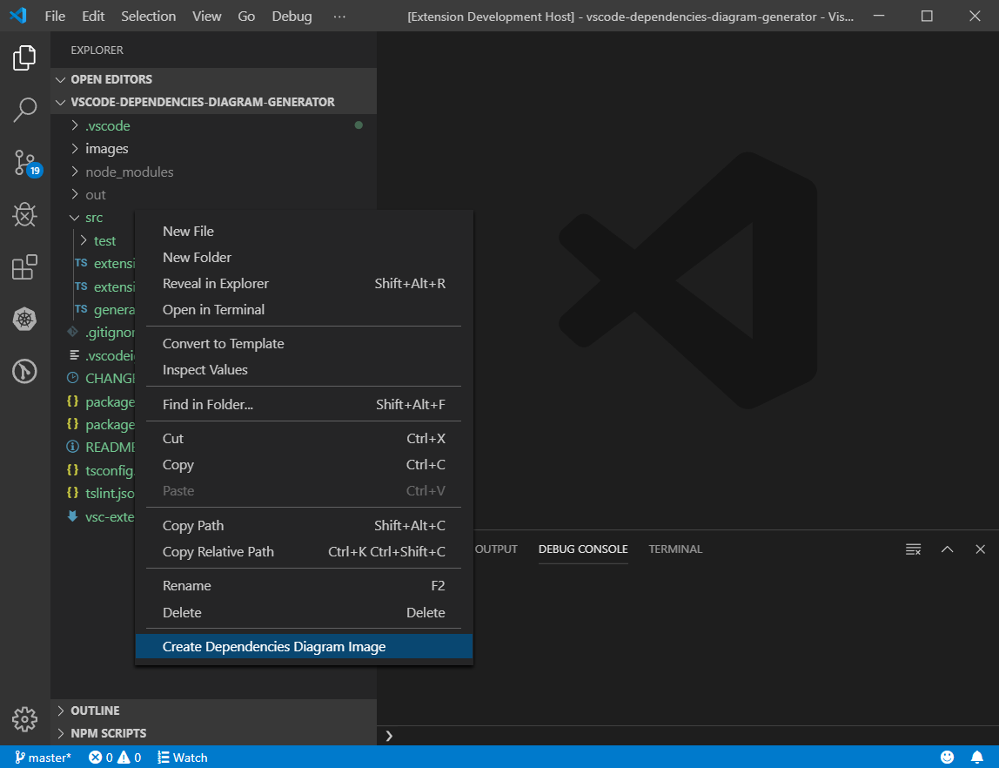
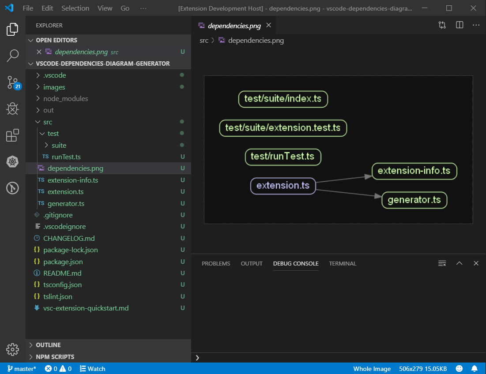

Extension that uses [madge](https://github.com/pahen/madge) to generate dependencies diaram image for TypeScript source code inside selected folder.

## Features

Extension reqisters command `` for folders in Explorer view.

It generates `dependencies.png` file in selected folder and opens it in editor.

## Release Notes

### 1.0.0

Initial release with simple command that generates a diagram image for `*.ts` files and opens it in default editor.

